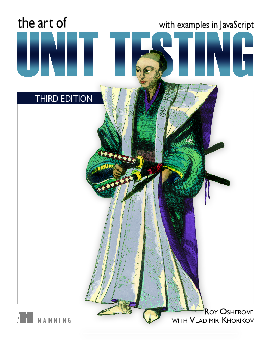

# The Art of Unit Testing

<p align="center" style="margin-top: 50px; margin-bottom: 50px">
    
</p>

I've implemented all the source code and test files from **The Art of Unit Testing** book;
All the source codes are converted from `Javascript` to `Typescript`.

## Usage

Each chapter has its own `package.json` file, and you can run:

```bash
    npm run test
```

Inside each chapter to see the test results.

## Technologies

You need to know following technologies in order to be able to understand the codes:

- Javascript
- Typescript
- Vitest
